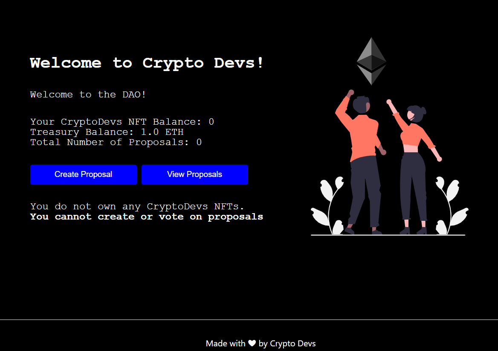
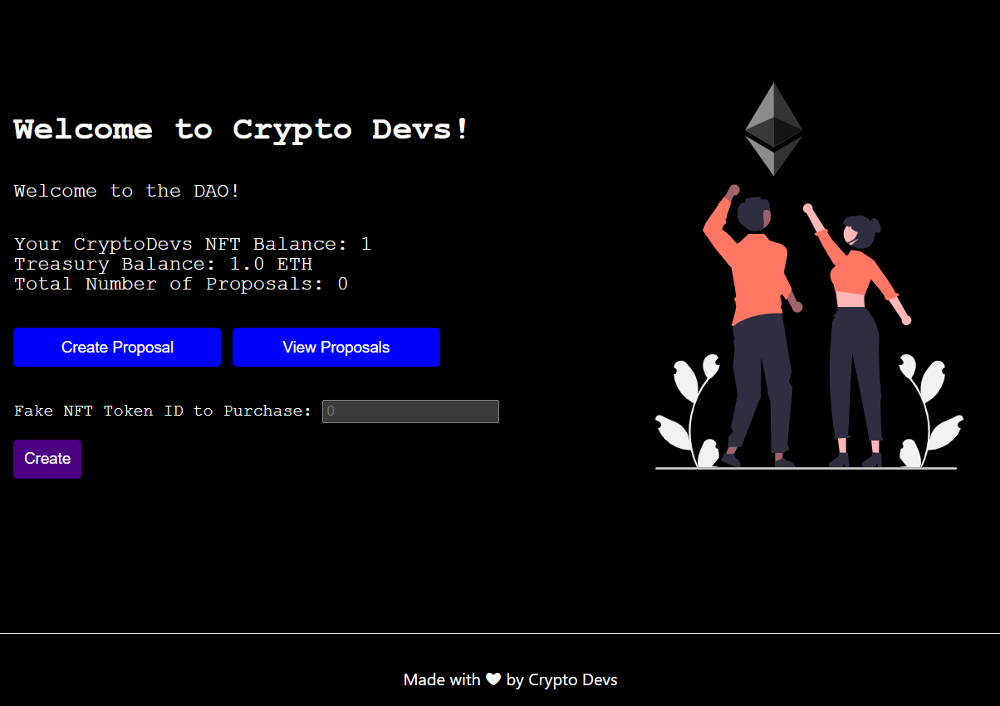

# Build a DAO for your NFT holders

This repo contains coursework project from [LearnWeb3](https://learnweb3.io/) completed by [0xsenzel](https://github.com/0xSenzel/) for [LearnWeb3DAO-Sophomore](https://learnweb3.io/courses/c1d7081b-63a9-4c6e-b35c-9fcbbad418b2) lesson.

## Project Info

ICO Dapp provides a platform for launching of ERC20 token by letting users with minted NFT from [NFT Collection](https://0xsenzel-nft-collection.vercel.app/) to mint 10 token for each NFT (free). For users that does not own the NFT, they will require 0.001 ether for 1 token.

## Project Demo

<figure>

<p align="center">Fig.1 - Eligible User's Login Page To Claim Token</p>
</figure>

<br/>

<figure>

<p align="center">Fig.2 - Non-Eligible User's Login Page to Mint Token</p>
</figure>

## Project Setup

### Hardhat

Head to [hardhat-tutorial](./hardhat-tutorial/) folder:

Install dependencies

```
npm install
```

Compile smart contract

```
npx hardhat compile
```

To deploy smart contracts: <br/>
Head to [hardhat.config.js](./hardhat-tutorial/hardhat.config.js) file, change the value of:

- `ALCHEMY_HTTP_URL` with your own Ethereum Network API
- `PRIVATE_KEY` with your Ethereum wallet's private key
- `API_KEY` with your Etherscan's API Key

Then run the following command.

```
npx hardhat run scripts/deploy.js --network goerli
npx hardhat verify --network goerli YOUR_SMARTCONTRACT_ADDRESS "CONSTRUCTOR ARG1" "CONSTRUCTOR ARG2"
```

### React & Next Js

Head to [my-app](./my-app/) folder:

```
npm install
```

Replace the variable inside [this folder](./my-app/constants.js):

- `CRYPTODEVS_NFT_CONTRACT_ADDRESS` with compiled ABI of [NFT-Collection](https://github.com/0xSenzel/nft-collection) contract.
- `CRYPTODEVS_NFT_ABI` with deployed contract of [NFT-Collection](https://github.com/0xSenzel/nft-collection) contract.
- `CRYPTODEVS_DAO_ABI` with compiled ABI of this contract
- `CRYPTODEVS_DAO_CONTRACT_ADDRESS` with deployed contract of this contract

To run the app locally:

```
npm run dev
```
